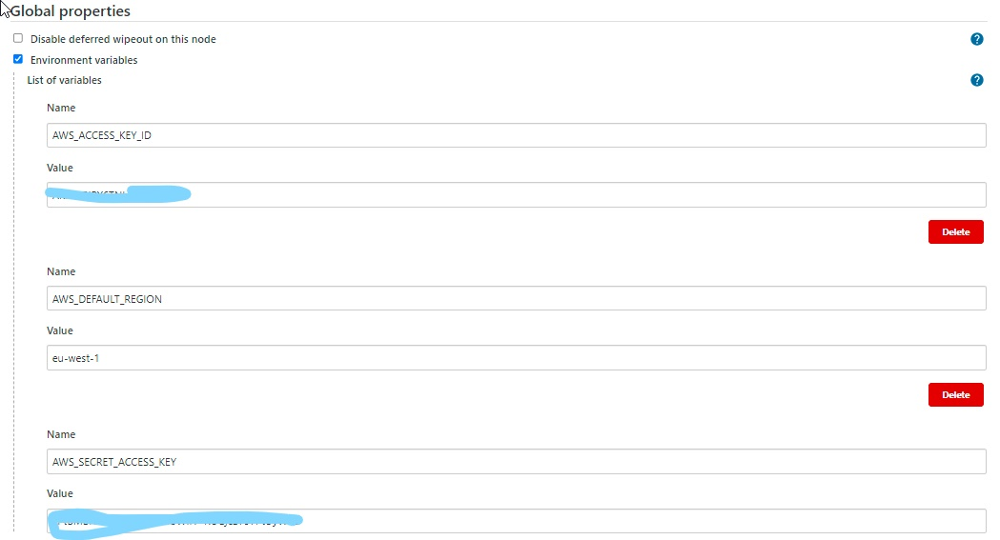
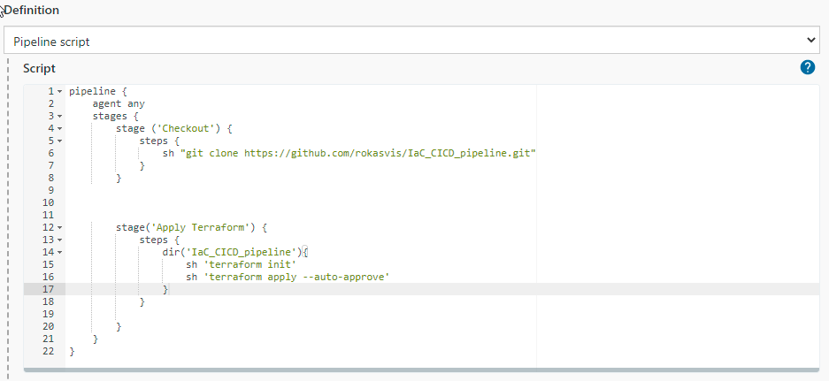
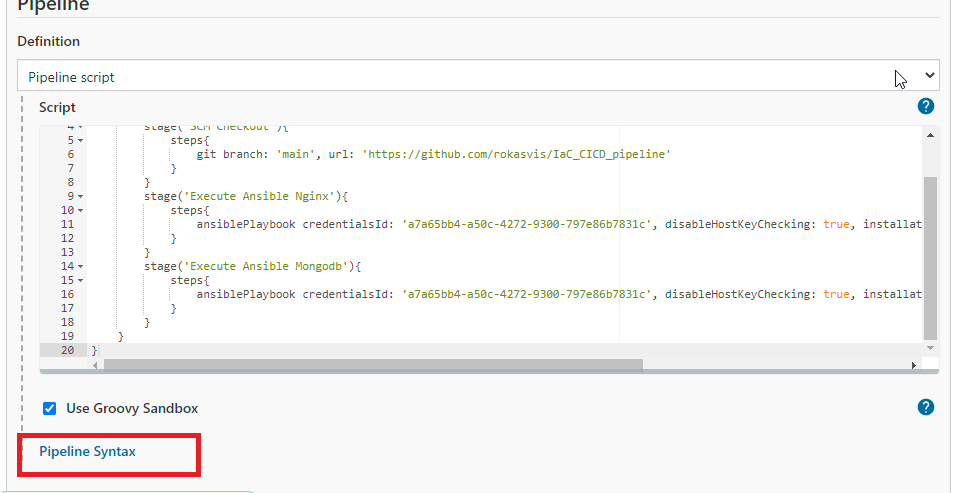
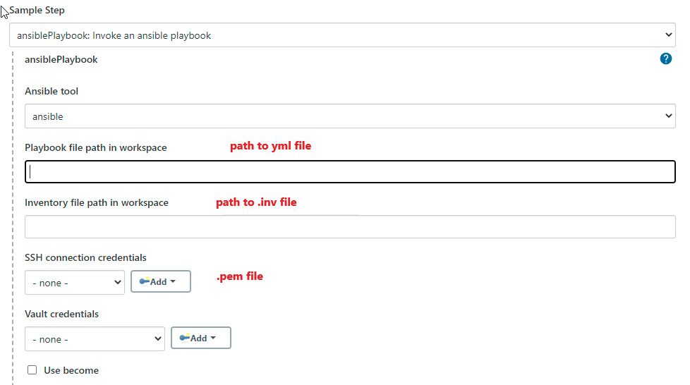
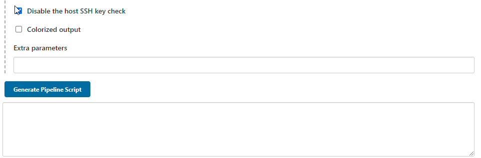

# Creating a Jenkins CI/CD pipeline using Terraform and Ansible 

## Install Terraform and Ansible plugins on Jenkins server 

- `Manage Jenkins` > `Manage Plugins`
- Search for `Terraform` `Ansible` and install 
- 
## Terraform script to launch 2 instances

- Terraform will be used to create:
    - A VPC
    - Private and Public subnets 
    - Internet gateway 
    - Routing tables 
    - 2 EC2 Instances

### Create a new job for terraform

- Add aws credentials to jenkins as enviroment variables
- `Manage Jenkins` `Configure System`

- Create a new pipeline

```
pipeline {
    agent any
    stages { 
        stage ('Checkout') {
            steps {
                sh "git clone https://github.com/rokasvis/IaC_CICD_pipeline.git"
            }
        }
   

    
        stage('Apply Terraform') {
            steps {
                dir('IaC_CICD_pipeline'){
                    sh 'terraform init'
                    sh 'terraform apply --auto-approve'
                }
            }
            
        }
    }
}
```
- The script will clone the github repo where the `main.tf` file is and run the build

## Run ansible playbook

- Create a new pipeline for `nginx ansible playbook`
- Add following script
```
pipeline{
    agent any
    stages{
        stage('SCM Checkout'){
            steps{
                git branch: 'main', url: 'https://github.com/rokasvis/IaC_CICD_pipeline'
            }
        }
        stage('Execute Ansible Nginx'){
            steps{
                ansiblePlaybook credentialsId: 'a7a65bb4-a50c-4272-9300-797e86b7831c', disableHostKeyChecking: true, installation: 'ansible', inventory: 'dev.inv', playbook: 'nginx.yml'
            }
        }
        stage('Execute Ansible Mongodb'){
            steps{
                ansiblePlaybook credentialsId: 'a7a65bb4-a50c-4272-9300-797e86b7831c', disableHostKeyChecking: true, installation: 'ansible', inventory: 'dev.inv', playbook: 'mongodb.yml'
            }
        }
    }
}
```
- To generate syntax go `Pipeline Syntax`



- 


